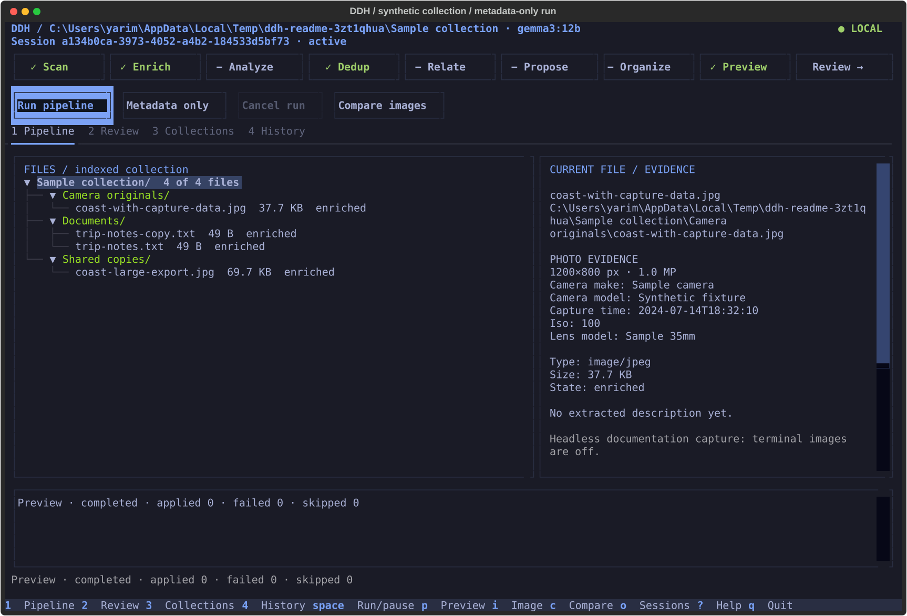
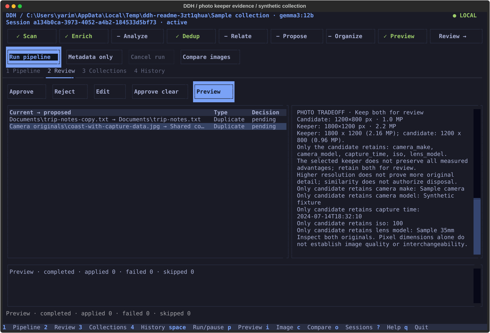

# DoneDataHoarder

**Organize files by what belongs together.**

A local-first file and folder organizer for the Linux terminal, built with
Omarchy in mind. Its pipeline draws on filenames, content analysis, the existing
folder tree, and metadata to infer relationships and propose a clearer structure.
Watch the reasoning, review the plan, and choose what changes.

[](https://github.com/Yariminal/DoneDataHoarder/actions/workflows/test.yml)
[](INSTALL.md)
[](LICENSE)

[Get started](#try-the-preview) · [How organization works](docs/organization.md) · [Terminal guide](docs/tui.md) · [Remote workstation](docs/remote-sessions.md)



*Actual Textual interface with a disposable sample collection. Headless captures
use text evidence; they do not demonstrate native terminal photo rendering.*

## Why this exists

Years of downloads, project exports, documents, media, and backups accumulate
context that a filename alone cannot explain. A drawing, its PDF export, a
reference image, and a materials list may belong to the same project. The
folders they came from are evidence too.

DDH turns that evidence into a reviewable organization plan:

- **Find relationships.** Identify related names, source/export companions,
  versions, and sequences, and expose the resulting collections for inspection.
- **Use content and context.** Available descriptions, semantic tags, file
  metadata, and the original folder hierarchy inform naming and organization.
- **Propose a better structure.** Review clearer names, eligible loose files
  grouped into folders, and folder renames. Dependency and project checks
  constrain what can move.
- **Preserve valuable copies.** Duplicate review compares photo resolution and
  meaningful EXIF, and makes preservation tradeoffs explicit.
- **Follow the whole pipeline.** Scan → Enrich → Analyze → Dedup → Relate →
  Propose → Organize → Preview. Approve and apply are separate actions.
- **Use the hardware you already own.** Keep the TUI on an Omarchy laptop while a
  paired Windows workstation processes the collection attached to it.

Signals are used at different stages: Relate currently groups chiefly from names
and directory context; Organize adds content-derived summaries and the folder
tree. See [how organization works](docs/organization.md) for the exact boundaries.

## Photo duplicates: preserve the image and its history

A full-resolution copy may be missing the capture date, camera, or lens metadata
that another copy retains. DDH ranks resolution and meaningful EXIF, shows what
each preserves, and lets you choose the keeper. Conflicting advantages stay in
review. Similarity alone does not prove that a copy is interchangeable.



## Try the preview

This is an **alpha preview** on the `codex/omarchy-tui` branch. The commands below
install that source, rather than assuming a package-index release contains it.
You need Git and [uv](https://docs.astral.sh/uv/getting-started/installation/).

```bash
git clone --branch codex/omarchy-tui https://github.com/Yariminal/DoneDataHoarder.git
cd DoneDataHoarder
uv tool install --python 3.12 '.[tui,docs,nearby]'
ddh tui
```

The installation uses an isolated environment. If `ddh` is not on `PATH`, follow
uv's shell setup message. The core CLI supports Python 3.10+; the TUI needs 3.12+.

Start with generated files if you want to explore first:

```bash
# Choose a new directory: this command refuses to overwrite an existing one.
ddh tui-fixture /tmp/ddh-preview
ddh tui --db /tmp/ddh-preview/index.sqlite
```

Select the saved fixture session, then press `c` to compare a duplicate pair.
The fixture includes deliberately changed, missing, and corrupt images for
checking error handling. It never approves or applies a change.

For your own folder:

```bash
ddh tui ~/Downloads
```

Press **`m` for metadata-only processing**: indexing, hashes, EXIF, duplicate
finding, and review work without Ollama. For AI descriptions and organization,
run Ollama and select an installed vision-capable model:

```bash
ddh tui ~/Downloads --model YOUR_INSTALLED_VISION_MODEL
```

The TUI uses the selected Ollama endpoint and does not switch to a cloud provider.
No model is downloaded by DDH installation. See [installation and troubleshooting](INSTALL.md).

## A small laptop, a capable workstation

Attach the collection to your workstation. Run the workstation service, open
`ddh tui --discover` on your laptop, select the nearby device, and paste its
one-use invitation. The same terminal interface controls the remote session;
the workstation performs processing and prepares image previews.

The connection indicator shows status. Paired devices can be revoked, processing
continues after the laptop disconnects, and uncertain commands are not blindly
replayed. Follow the [complete Windows + Omarchy setup](docs/remote-sessions.md).

Remote access currently uses explicit folder allowlists. An attached external
SSD is a supported collection location; **automatic SSD-only enforcement is not
implemented**. Discovery also depends on your LAN allowing multicast traffic.

## Made for the terminal

DDH follows Omarchy's active theme with a Tokyo Night fallback. Photos keep their
original colors. Foot/Sixel is the primary image target; Kitty graphics and an
external-viewer fallback are available. Actual terminal and multiplexer behavior
still needs the [native image checks](docs/tui-qualification.md).

| Key | Action |
| --- | --- |
| `1` / `2` / `3` / `4` | Pipeline / Review / Collections / History |
| `m` | Run metadata-only processing |
| `i` / `c` | Open an image / compare copies |
| `a` / `r` / `e` | Approve / reject / edit in Review |
| `p` | Preview approved changes |
| `F2` | Connection and workstation settings |
| `o` | Open a folder or saved session |
| `?` | Keyboard help |

## What changes your files?

Opening a workspace and running the pipeline build an index and proposals.
Applying reviewed proposals can rename or move files and place duplicates in
DDH's recovery trash. A separate preview and confirmation are required in the
TUI. History provides conflict-checked recovery; it is not a backup system.

New duplicate groups use the photo keeper policy. Existing keeper choices stay
intact. To backfill photo evidence in an existing index, run this on the machine
that owns the collection:

```bash
ddh refresh-photos --db /path/to/index.db --session SESSION_ID
```

This preserves AI analysis and keeper choices. Changed evidence returns affected
approvals to review. It does not merge metadata or rewrite your photographs.

## Current limits

- Pixel dimensions measure resolution, not sharpness or authenticity. Crops,
  edits, upscales, and metadata conflicts need human judgment.
- Structured photo evidence currently covers JPEG, PNG, WebP, TIFF, and BMP.
  RAW and HEIC/HEIF/AVIF metadata remain unsupported. Sidecars are not compared.
- Make intended cloud files local first. DDH does not add a OneDrive hydration
  policy; offline placeholders and scanner reparse-point exclusions still apply.
- The browser interface and older CLI workflows remain available. AI/provider
  support, document extraction, and video transcription have separate extras.
- Automated tests and isolated installs do not replace real Omarchy, native
  graphics, external-drive hotplug, or photo-library qualification.

## Documentation and contributing

| Guide | What it covers |
| --- | --- |
| [Install](INSTALL.md) | Linux, Windows, extras, models, updates, troubleshooting |
| [Terminal workspace](docs/tui.md) | Sessions, review, image controls, recovery |
| [Folder organization](docs/organization.md) | Relationship signals, content context, proposed structure |
| [Remote sessions](docs/remote-sessions.md) | Windows worker, nearby pairing, reconnect |
| [Photo keeper policy](docs/PHOTO_KEEPER_POLICY.md) | Ranking, tradeoffs, metadata support |
| [Validation status](docs/TUI_IMPLEMENTATION_STATUS.md) | Evidence and remaining hardware checks |
| [Contributing](CONTRIBUTING.md) | Development and tests |
| [Preview launch kit](docs/launch.md) | Demo sequence, screenshots, draft announcements |

Found a bad recommendation? A small reproducible pair, with the expected keeper
and explanation, is especially useful. See [how to report a bug](CONTRIBUTING.md#reporting-bugs-and-submitting-changes).

MIT licensed. Independent community project; not an official Omarchy application.
